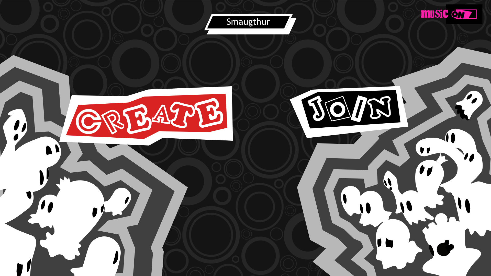
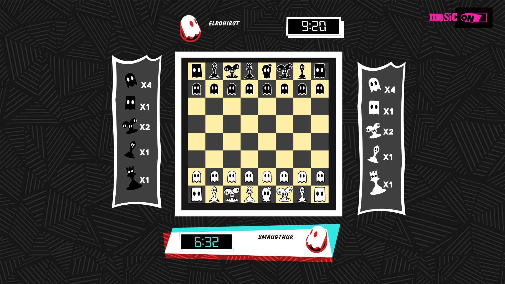

<div align = "center">
  <h1 align="center"> 
  <h1 align="center" style="font-style:italic;">
  Chessy</h1>
    <h5 align="center"> <i style="color:grey;"> 
   A toy chess app written in rust and Vue.</i> </h5>
</div>

## Watch it!
The project is live on:
[https://elrohirgt.github.io/Chessy/](https://elrohirgt.github.io/Chessy/)

## Thumbnails





## Roadmap

[The roadmap can be seen on trello](https://trello.com/invite/b/ZL1dRXbG/ATTIec8041a0c595db27db355cca3a4725e139F9AEF9/chessy)

## Compiling the project

All developer dependencies are defined on the flake.nix file. To use this file just install Nix, [enable Flakes](https://nixos.wiki/wiki/Flakes) and then proceed with the command:

```bash
nix develop
```

All terminal command blocks assume your on the base directory of this repo and that you are inside the developer session that the command above creates.

This command will read the nix file and setup everything that you'll need to develop the app. Everytime you wish to compile the app you'll need to enter this command to have access to all the dev-tools.

The first time you execute the command it may take a while because it needs to install node and rust.

### Compiling the Chess Engine

Run the following commands to compile the Chess Engine written in rust:

```bash
cd chess_engine
cargo build --lib
```

You can also compile the Chess Engine to be used on web assembly by running:

```bash
cd chess_engine
wasm-pack build --target web
```

This generates a pkg directory inside the `chess_engine` directory. This folder represents the module to be used inside the javascript client. [For more information you can watch this video](https://www.youtube.com/watch?v=nW71Mlbmxt8)

### Compiling the Chess Frontend

For testing and developing of the app frontend, run this command within `/chessy_frontend` folder.

```bash
yarn run dev
```

Then copy the URL showed in the terminal in a browser tab, and you are ready for start developing!
